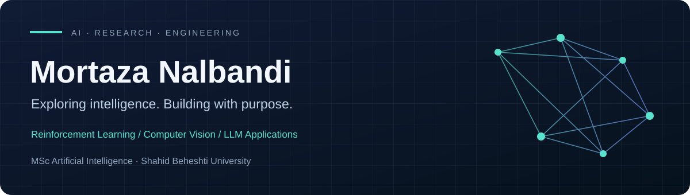

  

  <a href="mailto:mortazana8@gmail.com"><b>Email</b></a> &nbsp; / &nbsp;
  <a href="https://www.linkedin.com/in/mortaza-nalbandi-79462a248/"><b>LinkedIn</b></a> &nbsp; / &nbsp;
  <a href="https://github.com/Mortaza80Nalbandi?tab=repositories"><b>Explore my work ↗</b></a>

## A little about me

I'm an **MSc student in Artificial Intelligence at Shahid Beheshti University**, based in Tehran. I explore how intelligent agents learn, perceive, and act—from robot navigation and game AI to computer vision and language model applications.

My experience also spans **Unity game development** and **backend projects in Go and .NET**.

## Tools I work with

 

**Continuing to develop:** computer vision, NLP, Go backend development, .NET, and game design.

## Selected work

01 / ROBOTICS

### [Robot Navigation with DQN ↗](https://github.com/Mortaza80Nalbandi/webots_Navigation_DQN)

Learning to navigate obstacles and reach a target in Webots.

Python · DQN · Webots

 

02 / GAME AI

### [Learning to Survive ↗](https://github.com/Mortaza80Nalbandi/Agent_Reinforcement_Surival_Game)

My BSc thesis: a Q-learning-based agent in a 2D survival game.

C# · Unity · Reinforcement Learning

 

03 / GENERATIVE AI

### [In-Context Learning & RAG ↗](https://github.com/Mortaza80Nalbandi/In-Context-Learning-and-RAG)

Few-shot prompting and conversational retrieval with embeddings and MMR.

LangChain · ChromaDB · RAG

 

04 / NATURAL LANGUAGE

### [Classical NLP ↗](https://github.com/Mortaza80Nalbandi/Naive-Bayes-TFIDF-and-Random-Forest-NLP)

Naive Bayes spam detection from scratch and Random Forest news classification.

TF-IDF · Naive Bayes · Random Forest

 

05 / COMPUTER VISION

### [Low-Light Image Enhancement ↗](https://github.com/Mortaza80Nalbandi/LowLightImage-enhancment)

Research-paper implementation for an image-processing course.

Python · Image Processing

 

06 / BACKEND

### [Go Backend Projects ↗](https://github.com/Mortaza80Nalbandi/go-backend-projects)

REST APIs, database integration, task management, and real-time communication.

Go · SQL · WebSockets

 

## Research explorations

**[Neural Fuzzy Actor-Critic ↗](https://github.com/Mortaza80Nalbandi/RL_AC_FUZZY)**  
Interpretable robot control through fuzzy systems and reinforcement learning.

**[Model Compression ↗](https://github.com/Mortaza80Nalbandi/Model_Compression)**  
Exploring more efficient neural networks for MLP-based classification.

**[Synaptic Scaling ↗](https://github.com/Mortaza80Nalbandi/Synaptic_Scaling)**  
Research-paper implementation exploring deep learning regularization.

**[CNN Projects ↗](https://github.com/Mortaza80Nalbandi/CNN-Projects)**  
Visual learning through U-Net colorization, reconstruction, and classification.

 

## Academic background

2023 — PRESENT · SHAHID BEHESHTI UNIVERSITY

### MSc in Artificial Intelligence

GPA **18.13 / 20**

 

2019 — 2023 · K. N. TOOSI UNIVERSITY OF TECHNOLOGY

### BSc in Computer Engineering

GPA **18.52 / 20**

<b>Selected MSc coursework</b>

Machine Learning · Deep Reinforcement Learning · Computer Vision · Digital Image Processing · Pattern Recognition · Big Data

 

## Experience

**ML Engineer & Data Scientist** · Shahid Beheshti University  
JULY — AUGUST 2026

**Freelance Telegram Bot Developer**  
JULY 2026 — PRESENT

**Unity Developer** · Funtory Game Studio and Publisher

**Software Developer & ML Intern** · IPM  
JUNE — SEPTEMBER 2023

<b>Teaching experience</b>

Teaching Assistant at **Shahid Beheshti University** and **K. N. Toosi University of Technology**, supporting courses in Deep Reinforcement Learning, Pattern Recognition, Deep Learning and Neural Networks, Linear Algebra, and Programming.

 

## Publication

**MQL-NPC: A Modified Q-Learning-based Approach to Design Intelligent Non-Player Character in a Survival Game**  
Athena Abdi and Mortaza Nalbandi · 1st International Conference on Artificial Intelligence, Shahid Beheshti University · February 2025

## Languages

Persian — Native · Turkish — Native · English — Proficient

---

Learning through research. Growing through building.

